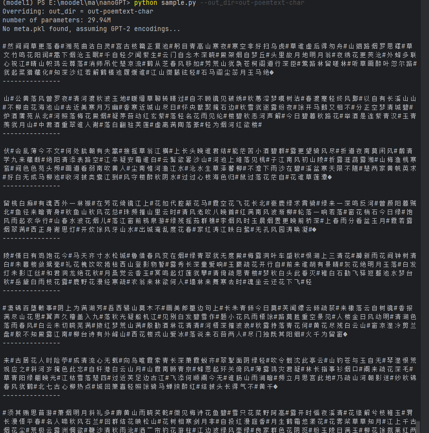

# nanoGPT 复现与中文文本生成项目

## 📌 项目简介

本项目基于 Karpathy 开源的 nanoGPT，实现了一个轻量级 GPT 模型的训练与文本生成流程。  
在完成英文数据集复现的基础上，进一步扩展至中文语料（唐诗与小说），探索模型在不同语言与文本结构下的生成能力。

---

## 🚀 项目亮点

- 从零复现 GPT 模型训练流程（数据处理 → 训练 → 生成）
- 支持中英文文本生成（Shakespeare / 唐诗 / 小说）
- 对比不同数据结构对模型效果的影响
- 分析中文生成中的关键问题（乱码、语义建模等）

---

## ⚙️ 环境配置

- Python 3.9+
- PyTorch 2.1
- CUDA（可选）

```bash
📂 项目结构
.
├── data/                # 数据集
├── model.py             # GPT模型定义
├── train.py             # 训练脚本
├── sample.py            # 文本生成
├── config/              # 配置文件
├── assets/              # 实验结果截图
└── out/                 # 模型输出
🚀 使用方法
1️⃣ 数据准备
python data/shakespeare_char/prepare.py
（中文数据需自行整理为 txt 格式）

2️⃣ 模型训练
python train.py config/train_xxxxxx_char.py
3️⃣ 文本生成
python sample.py --out_dir=out-xxx
📊 实验结果
🏮## 唐诗生成效果

## 小说生成效果

结果分析
能生成类似古诗的句式结构（短句 + 意象词）
具备一定“诗意表达”能力
存在问题：
部分乱码（编码/token问题）
平仄与押韵不严格
语义连贯性较弱
📖 小说文本生成

结果分析
能生成基本对话与叙事结构
句子通顺性较好
存在问题：
长距离依赖能力不足
上下文容易漂移
偶尔出现乱码
📈 多数据集对比分析
数据集	特点	生成效果
Shakespeare	英文、结构简单	语法较好
唐诗	强结构（短文本）	易学习形式
小说	长文本、语义复杂	连贯性较弱
🧠 关键问题分析
1️⃣ 中文乱码问题

原因：

使用 GPT-2 tokenizer（偏英文）
中文分词不适配

解决：

使用字符级建模（char-level）
或引入 BPE / SentencePiece
2️⃣ 模型能力限制
模型规模约 29M 参数
数据量较小

导致：

长文本建模能力不足
生成稳定性有限
3️⃣ 数据对模型影响

结论：

数据结构越强（如唐诗），模型越容易学习形式
数据越复杂（如小说），越依赖模型规模和训练时间

🔧 我的优化
调整 batch_size，避免显存溢出
调整 learning rate，提高收敛稳定性
使用字符级建模优化中文生成
扩展多数据集进行对比实验
🧠 实验总结

本项目在完成 nanoGPT 基础复现的基础上，进一步探索了其在中文文本生成任务中的表现。

实验表明：

nanoGPT 具备跨语言建模能力
对结构化文本（如诗歌）学习效果较好
对长文本（小说）生成仍存在上下文建模不足问题

说明模型性能高度依赖数据规模与模型规模。

💡 改进方向
引入 tokenizer（BPE / SentencePiece）
增大模型规模（n_layer / n_embd）
使用更大规模中文语料
尝试预训练 + 微调策略